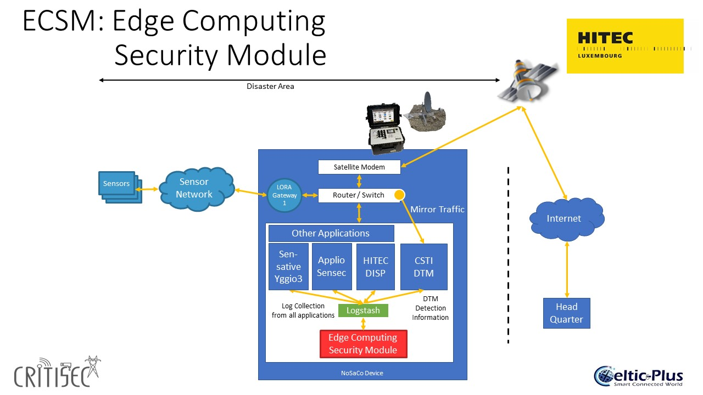
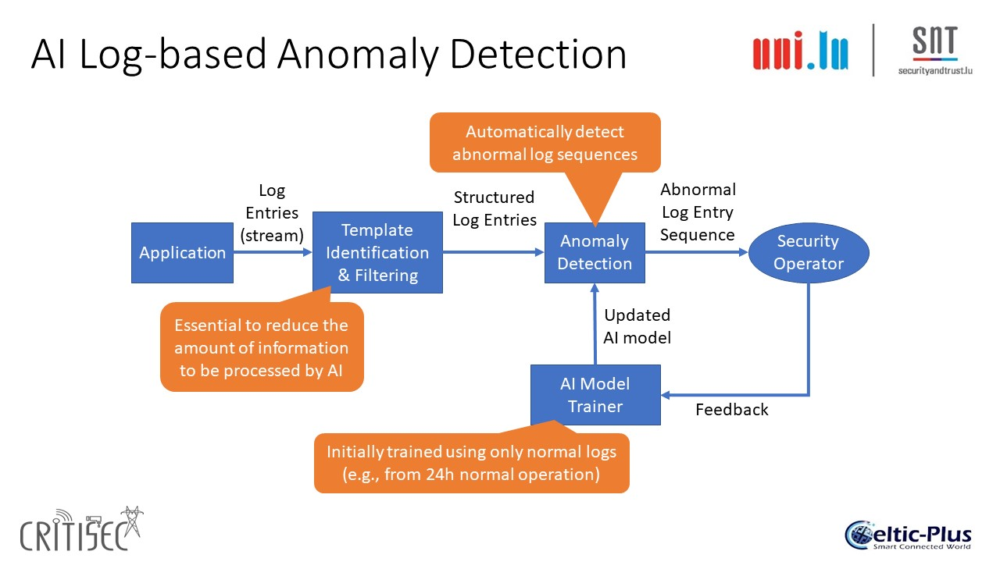
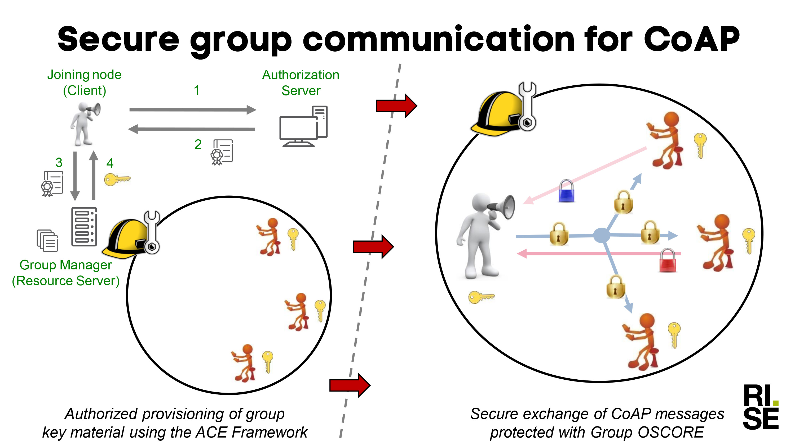
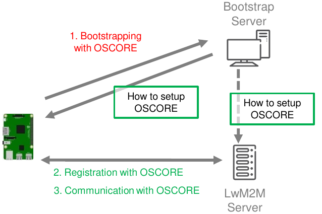
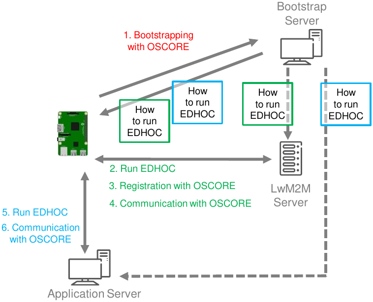

# CRITISEC Demonstrators

The CRITISEC project has implemented 5 real life demonstrators to show the capabilities of the CRITISEC solutions:

* [Energy Distribution](#energy-distribution)
* [Smart City](#smart-city)
* [Critical Communication](#critical-communication)
* [Secure End-to-end Group Communication](#secure-end-to-end-group-communication)
* [Secure and Automated Device On-boarding](#secure-and-automated-device-on-boarding)

---

## Energy Distribution

Involved partners: Kraftringen (SE), Sensative (SE), Applio (SE)

Objective - Increase monitoring and control of energy distribution grid with IoT
•	Sensors connected by sensor networks and an open IoT-platform. The sensor network and the open IoT-platform  has to be secure, robust and resilient. 
  *	The energy distribution grid is classified as security sensitive business (Protective Security Act) and societal critical business (Authority for social protection and emergency preparedness)
•	Lower cost than existing solutions

Benefits vs state of the art
•	Improved quality – reduce power failures and outage time for customers
•	Improved efficiency and lower cost – from scheduled to event-based maintenance and since sensors are wireless (LoRaWAN) it can get  expanded quickly with low installation cost. 
•	Improved security - enables monitoring of physical access to the electricity stations and cabinets. E2E security feasible in the future with OSCORE once sensor manufacturers integrated the technology.
•	Improved scalability - the horizontal IoT platform has a wide range of connectivity options which means future use cases built upon modern IoT technologies quickly can be enabled.    
The test bed is applied in Kraftringen’s electricity grid, but similar solutions can be applicable also for other energy infrastructures. In the electricity grid, two substations connected in a loop with eight more substations, fed from a main station, are equipped with LoRaWAN fault sensors and door sensors. 

The fault sensor will send a fault message when a power fault occurs in the loop of the substation. Then the operator will be able to know more exactly the location of the fault and due to that get the reparation started faster and get the outage time for customers reduced. The door sensor will send a message at least every time the door is opened or closed. This gives the operator the possibility to know, for example, whether people for reparation are in place as planned or if a door is unintentionally left open. 
Sensative Yggio is applied as the open IoT platform to collect LoRaWAN sensor data to Kraftringen. Yggio includes security innovations and enhanced connectivity options developed in Critisec which takes it beyond state of the art for an IoT platform and qualify for the use case: 
*	KeyCloak - identity and access management as well as wide support for security integrations.
*	FIWARE NGSI v2 Context Broker (RATATOSK) - enables 3rd party applications to connect to Yggio retrieve data that they have been authorized to access.
*	Kubernetes orchestrator - robustness and resilience through horizontal scaling
*	Access engine - authorization engine tuned for performance. 

Applio Sense is applied to monitor the LoRaWAN network for anomaly detection to secure that it is not being tampered with. Applio Sense gets access to the LoRaWAN network by using the secure connectivity options in Sensative yggio.  The following items are checked to evaluate if collected  sensor data can be trusted or not:
*	Anomalies for a single device, device is fake or tampered
*	Anomalies for a single device, instable behaviour like multiple reboots or low battery. 
*	Anomalies for a single device, instable radio performance
*	Anomalies for several devices connected to a certain gateway 
Results is that the technologies in the demonstrator is confirmed to be working well and it is executing in a live energy distribution grid. The work on the demonstrator will continue in a commercial setting between Kraftringen, Sensative and Applio. The use case as such is applicable to all energy distribution companies

---

## Smart City

Involved partners: Tyrens (SE), Sensative (SE)

A city municipal administration is a complex social system. It includes several verticals such as utilities, departments, internal systems, services and processes, which are mostly implemented at different times. These systems may be developed based on legacy technologies and or proprietary systems that obstruct the exploitation of the old city infrastructure as valuable resources. For this reason, we recommend that different city applications should not be depicted as segregated silos that require a holistic approach. In a smart city context, interoperability among the different assets and city departments becomes crucial for delivering efficient city operation and/or services, capitalized on a smart city infrastructure.
Most smart cities infrastructures are implemented based on an edge network that exchanges data with a back-end IT system for the purpose of supporting applications in several possible topologies. CRITISEC adopts a smart city test bed with focus on smart street lighting, by which a common horizontal connectivity platform across the city enables and supports various applications. Cities that choose to use horizontal IoT platforms with open and standardized APIs, such as FIWARE NGSI, will enable them to develop shared city dashboards and compare with each other.
Objectives:
* Deploy a managed street lighting system with wireless motion sensors based on 6LoWPAN protocol.
*	Integrate the street lighting system and additional environmental wireless sensors based on LoRa in a smart city open, horizontal platform
*	The horizontal platform should apply the open API’s and data formats based on the  FIWARE standard while including a comprehensive security solution and being fully compliant to GDPR privacy requirements.

The smart city / village demonstrator and test bed includes Atelié Lyktan Pepper luminaires, which are controlled and monitored through the Seneco Citygrid control portal. Luminaries are equipped with integrated sensors and control units (Citygrid InFix) that are interconnected using a 6LoWPAN wireless mesh network. CRITISEC enables the Citygrid portal to be adapted and integrated via secure FIWARE APIs and data formats with Sensative Yggio as a horizontal Smart City platform together with LoRa environmental IoT sensors. This integrated solution capitalizes on common API data models for seamless cloud interfacing between Yggio and Citygrid, conforming security, functional, non-functional and developmental requirements and common APIs data.
Benefits vs state of the art:
*	Connected system based on European open standard (RATATOSK) FIWARE API’s and data format in a horizontal system instead of separate vertical pillars to enable smart city dashboard. The city owns all data.
*	FIWARE API’s complemented with open source component KeyCloak as a security plug-in to enable secure connectivity between systems as well as integration with external identity management system based on SAML 2.0, LDAP, AD, Open ID, Social Login, etc.
*	Robustness, resilience and scalability based on Kubernetes orchestrator and Yggio access engine. Verified with 1 000 000 devices on data model level. 

---

## Critical Communication

Involved partners: HITEC (LU), Uni Lux (LU), Sensative (SE), Applio (SE), CSTI (TW)

The Critical Communication Demo shows how CRITISEC solutions can be used to secure the Communication of first responders in disaster areas.
The basis of the communication is the Nomadic Satellite Communication System, short NoSaCo. The NoSaCo is a ruggedized and easy to install box that provides Satellite connectivity to the headquarter and a WiFi and IoT network on the disaster side, when no other communication means are available.
The NoSaCo also includes a server to run different services needed for the work of the first responders.

Figure 3.1: Critical Communication Demonstrator Architecture

For the security of the LoRa based  IoT network the same solutions are used that are already used in the Energy distribution and Smart Cities demo: Sensative’s Yggio 3 and Applio’s Sensec.
For the security of the whole network the DTM-Module of our Taiwanese partner CSTI is used. The DTM-module detects, tags and mitigates attacks to the communication network.
For the security of all applications running on the sever (including Yggio3 and Sensec) an innovative new concept is used in the Edge Computing Security Module (ECSM).
The ECSM analyses the logs generated by the applications running on the NoSaCo server and uses specific Artificial Intelligence models to detect anomalies in the behaviour of the applications.
To accomplish this all logs from the applications are collected in a LOGSTASH repository. Logstash is a free and open server-side data processing pipeline that ingests data from a multitude of sources, transforms it, and then sends it to an application that can be specified by the user - in this case to the ECSM.
ECSM is reading the logs, generates templates and removes noise and the analyses the log templates using a specialized AI Model.

Figure 3.2: Log-based anomaly detection process

The system is trained by the normal behaviour of the applications in real-life for minimum 24 hours. It then can detect anomalies in the behaviour of the applications and alert an operator when anomalies are detected. The operator can accept the anomaly as normal and the AI model now knows that this behaviour is ok or as anomaly and start mitigation actions.
In the practical demo we will concentrate on the ECSM workflow.
The scenario is as follows:
* NoSaCo is setup in a disaster area
* A LoRa network is used to connect GPS sensors to locate First responders
* A monitoring application uses the Yggio API to collect information from sensors and to configure the sensors. The application has read and write access to the API
*	An attacker successfully attacks this application and controls it
*	The attacker tries to change the sensor configuration via the YGGIO API
*	Yggio refuses this request and creates a log entry about this activity
*	ECSM is using the flow described in figure 2 and detects an anomaly in the information flow.
*	ECSM alerts the operator, who can accept the anomaly or mark it as anomaly and start mitigation actions

---

## Secure-End-to-End Group Communication

Involved partners: RISE (SE)

This demo considers the group communication model, where network nodes acting as client can send a single message to multiple recipient servers, e.g., over IP multicast. Recipients can reply back with responses over unicast. Typically, IoT-based networks and applications use the communication protocol CoAP, which natively supports such communication model.
In particular, this demo consists of an early proof-of-concept showing a number of network nodes joining a group where communication occurs also over IP multicast and is protected end-to-end with the Group OSCORE security protocol. The authorized joining process occurs through the Group Manager (GM) for the group and relies on the ACE Framework for Authentication and Authorization.

This demo leverages a number of technical security components developed during the project.

* Group OSCORE - The Group OSCORE protocol builds on the OSCORE protocol standardized in RFC 8613, and provides end-to-end protection of CoAP messages exchanged in a group communication environment. Group OSCORE fulfils the same security requirements of OSCORE, and especially provides source authentication of exchanged messages. This can be achieved in two different ways, depending on the exact mode of operation used to protect a certain message, i.e., either the “group mode” typically used for one-to-many messages or the “pairwise mode” typically used for one-to-one messages.
*	Joining of an OSCORE group with the ACE framework - The ACE Framework builds on the OAuth 2.0 framework as an access control solution for the IoT. An ACE Client obtains an Access Token from an Authorization Server (AS), as a credential proving a set of owned access rights. Then, the Client uploads the Access Token at an ACE Resource Server (RS). Finally, the Client can access resources at the RS, as allowed by the obtained Access Token.
This can be used for authorized joining of OSCORE groups. That is, a candidate group member acts as ACE Client, while the GM of the OSCORE group acts as ACE RS. By uploading the Access Token at the GM, the candidate group member proves to be authorized to join a certain OSCORE group. Then, it engages in a joining procedure with the GM, from which it obtains the keying material for operating in the OSCORE group, hence becoming a member of that group able to securely communicate with other group members using Group OSCORE.

The step forward from the current state-of-the-art and incarnated in this demo is a solution for authenticated and authorized provisioning of group key material followed by secure end-to-end group communication, with different modes of operation available to ensure good performance.
This solution is overviewed in the high-level workflow depicted in Figure 4.1. That is: i) each device obtains an authorization evidence for joining an OSCORE group, and then joins the intended OSCORE group through the associated Group Manager; ii) a group member sends secure commands to the other group members over IP multicast and protected with Group OSCORE, with responses following.

Figure 4.1 - Overall workflow as: i) group joining; ii) secure group communication with Group OSCORE

## Secure and Automated Device On-boarding

Involved partners: RISE (SE), Sony Nordic (SE), Applio (SE)

This demo considers the onboarding of IoT devices as a fundamental, early step in their lifecycle, where first crucial steps are taken to ensure that following communications are properly secured.
In particular, this demo consists of an early proof-of-concept showing how it is possible to achieve a fully automated IoT device onboarding, whose outcome includes the establishment of secure communication associations with high-level security.

As summarized below, this demo considers the standard framework for device management OMA Lightweight Machine-to-Machine (LwM2M), as well as a number of technical security components.
*	OSCORE - The security protocol Object Security for Constrained RESTful Environment (OSCORE) has been standardised as RFC 8613, and provides end-to-end protection of messages exchanged by two peers using the protocol CoAP. OSCORE is especially efficient, as leveraging the standard CBOR and COSE also suitable to IoT devices. Before two peers securely communicate, they are required to establish an OSCORE Security Context.
*	LwM2M - The OMA standard LwM2M provides a control and management framework for IoT devices. An IoT device acting as LwM2M Client first “bootstraps” at a Bootstrap Server, and then “registers” at a LwM2M Server. Once completed the registration, the LwM2M Client and Server securely communicate with one another, e.g., for retrieving information from or issuing commands to the LwM2M Client. Typical communications in LwM2M rely on CoAP, and can be protected by different means, e.g., by using OSCORE. The original LwM2M bootstrapping and registration processes using OSCORE occur as depicted in Figure 5.1.

Figure 5.1 - Original LwM2M workflow using OSCORE

*	EDHOC - Ephemeral Diffie-Hellman Over COSE (EDHOC) is a novel, efficient key establishment protocol as well as an IETF standardisation proposal. EDHOC allows two peers to mutually authenticate and then establish a fresh secret enjoying Perfect Forward Secrecy. The main use case for EDHOC is the authenticated establishment of an OSCORE Security Context.

The step forward from the current state-of-the-art and incarnated in this demo is the integration and use of the EDHOC key establishment protocol within the LwM2M framework.
Thus, when relying on EDHOC throughout the enrolment process, an IoT device can establish OSCORE Security Contexts with other parties (notably the LwM2M Server, but also further external Application Servers), in a way which is fully automated, providing a degree of negotiation in security parameters, and ensuring high-level security properties (e.g., Perfect Forward Secrecy).
The result of such an integration is overviewed in the workflow depicted in Figure 5.3. The demo execution will practically show such a workflow throughout its steps.

Figure 5.2 - Alternative LwM2M workflow using EDHOC and OSCORE

---

