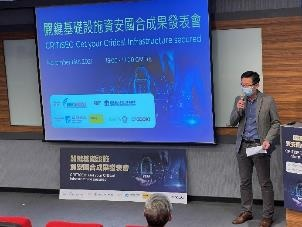
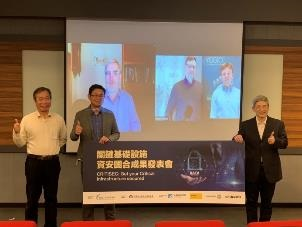
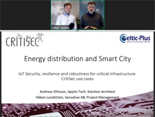

# CRITISEC Events

The CRITISEC project participated or organised 3 events

* [Eureka Celtic Next Event](#Eureka-Celtic-Next-Event)
* [CRITISEC Workshop Taiwan](#CRITISEC-Workshop-Taiwan)
* [Jönköping Event](#Joenkoeping-Event)

---

## Eureka Celtic Next Event

Date: June 19th - 20th, 2019
Location: Valencia, Spain

Presenter: Harold Linke, HITEC Luxembourg

Presentation of CRITISEC.

[Link to Celtic-Next-Event Valencia 2019](https://www.celticnext.eu/event/celtic-event-co-located-with-eucnc-19-20-june-in-valencia-spain/)

Video: Interview with Harold Linke, CRITISEC Project Coordinator:

[Link to video](https://youtu.be/rtJheaQhTAc)

---

## CRITISEC Workshop Taiwan

Date: Nov 16th, 2021

Location: Taipeh, Taiwan

Agenda:

* 15:00-15:10	Message from the Chief / VIP	CSTI Tsai Chengyu, Director and Hitec Harold Linke Project Coordinator
* 15:10-15:15	Group photo	 
* 15:15-15:30	Critical Infrastructure Project	Hitec Harold Linke Technical Director
* 15:30-15:45	Taiwan-EU Critical Infrastructure Cooperation Project	CSTI Tsai Chengyu, Director 
* 15:45-16:15	Case sharing on the safe use of European energy, smart cities and the Internet of Things	Sensative Håkan Lundström Project Manager Senior Analyst, Applio Andreas Ohlsson
* 16:15-16:25	Break	 
* 16:25-16:40	Power supply is converted from traditional to smart power supply	Deputy Director of Taipower Li Jianlong
* 16:40-16:55	Challenges and solutions of industrial control systems	CSTI Dr. Lin Zhida Senior Researcher
* 16:55-17:00	Conclusion Closing Remarks	CSTI Tsai Chengyu, Director

Opening remark by Director Tsai Chengyu

Group photo from the speakers of European and Taiwan 

Håkan Lundström /Sensative) and Andreas Ohlsson (Applio) present “Demo Energy Distribution and Smart Cities”

---

## Joenkoeping Event

Date: Jan 26th, 2022

Location: Jönköping, Sweden

Audience:
*	Sweden Region Jönköping Digitalization Project consisting of total 13 municipalities
*	Representatives from the companies CombiTech and SopraSteria.

Presenters:
* Andreas Ohlsson, Applio
* Håkan Lundström, Sensative
* Marco Tiloca, RISE

Agenda:

  *	CRITISEC use cases 
    -	Presentation: Sensative, Yggio 
    -	Presentation: Applio, Sense
    -	Use case: Energy Distribution. 
    -	Anomaly detection in IoT Networks, focus energy distribution 
    -	Scale up use case: Smart City 
    -	Security in large IoT Deployment like a Smart City
  * Secure E2E communication:
    - CoAP
    - OSCORE and Group OSCORE 

Presentations:
* [CRITISEC use cases](presentations/CRITISEC_Region-Joenkoeping_Intro_2022-01-26.pdf)

* [Secure E2E communication](presentations/CRITISEC_Region-Joenkoeping-OSCORE_2022-01-26.pdf)

---

